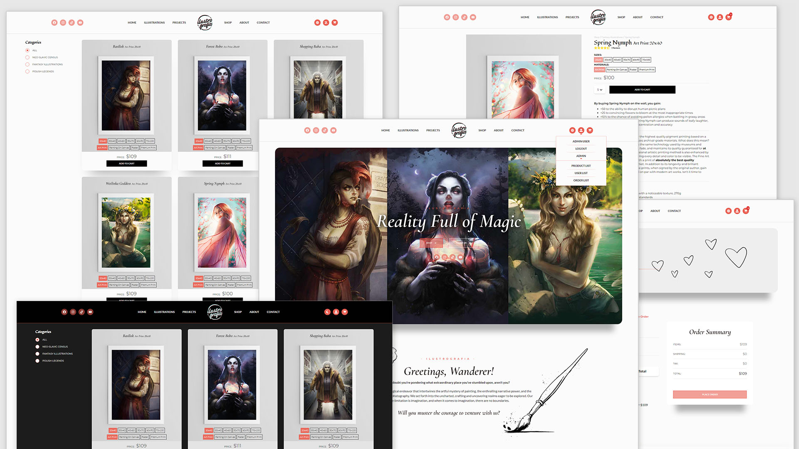
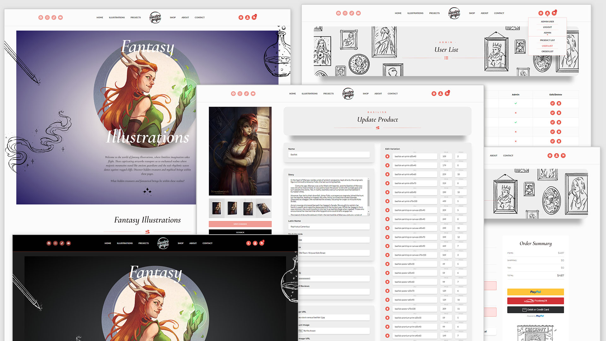

# ilustrografia.com

[**Live Demo - ilustrografia.com**](https://ilustrografia.com/) 👈

#### eCommerce platform built with the MERN stack & Redux & Typescript



## Description
This is a beautifully styled and responsive e-commerce platform designed for an artist who sells prints of her digital paintings. The website offers a variety of print sizes, materials, and prices. To manage this diversity, the database was carefully structured to accommodate different product variants, including size, material, stock count, prices, names, descriptions, images of the digital paintings, and visualization images for each material.

To ensure a clean and user-friendly interface, Product Variants were created, allowing users to easily select the size or material they prefer while dynamically updating the price and images.

For each product, there is an illustration page featuring the main image, various product variants, and a description of the illustrated creature. The shop page enables users to filter products by category, while the illustrations page provides filtering options for illustrations by category.

## Key Features

- Full-featured shopping cart
- Product reviews and ratings
- Product and illustration filtering
- User profiles with order history
- Admin panel for product and user management
- Admin Order details page
- Order tracking and status updates
- Checkout process with shipping and payment method selection
- PayPal and credit card integration
- Database seeding for products and users
- Fetching the latest YouTube animations using the YouTube API
- Dark/Light theme

## Technologies Used

- TypeScript
- React
- MongoDB with Mongoose
- Node.js with Express
- Redux for state management
- Redux Toolkit, RTK Query
- Postman for API testing
- Radix UI
- Lodash
- Helmet
- Tailwind CSS for styling
- Continuously deployed on Render.com

#### In progress

- Integration tests (React Testing Library)
- E2E tests with Cypress

[**Live Demo - ilustrografia.com**](https://ilustrografia.com/) 👈



Building this advanced project with responsiveness, light/dark theme support, and user experience in mind was a journey. Modern technologies were employed to bring this project to life, and every effort was made to ensure its success. We hope you enjoy it!

## The Artist

- [Meggiem.Art](https://www.instagram.com/meggie_art/) the Artist 👈

## Usage

1. Create a MongoDB database and obtain your `MongoDB URI` - [MongoDB Atlas](https://www.mongodb.com/cloud/atlas/register)
2. Create a PayPal account and obtain your `Client ID` - [PayPal Developer](https://developer.paypal.com/)

### Environment Variables

Rename the `.env.example` file to `.env` and add the following:

```
NODE_ENV = development
PORT = 5000
MONGO_URI = your mongodb uri
JWT_SECRET = 'abc123'
PAYPAL_CLIENT_ID = your paypal client id
YOUTUBE_API = your yt API
```

Feel free to change the JWT_SECRET to a custom value.

### Install Dependencies (frontend & backend)

```
cd frontend
npm install
cd ../backend
npm install
```

### Run

```

# Run backend (:5000)
npm run dev

# Run frontend (:3000)
cd ../frontend
npm start

```

## Build & Deploy

```
# Create frontend prod build
cd frontend
npm run build
```

### Seed Database

In the backend you can use the following commands to seed the database with some sample users and products as well as destroy all data

```
cd backend

# Import data
npm run data:import

# Destroy data
npm run data:destroy
```

```
Sample User Logins

admin@email.com (Admin)
123456

john@email.com (Customer)
123456

jane@email.com (Customer)
123456
```

---